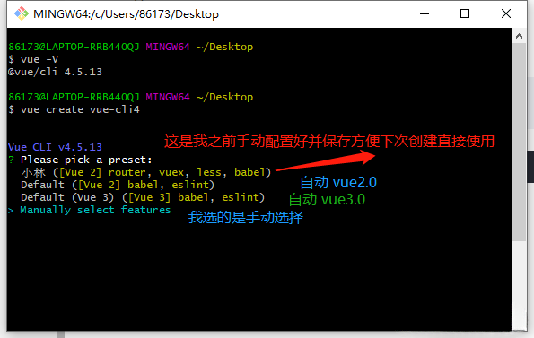
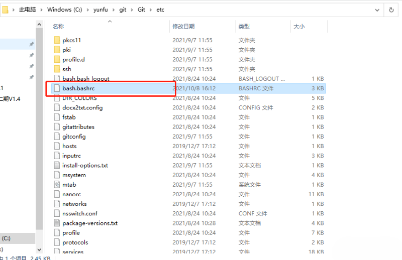
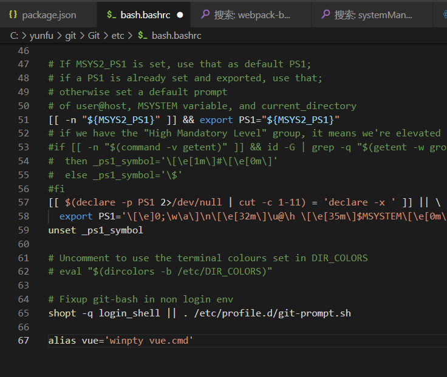
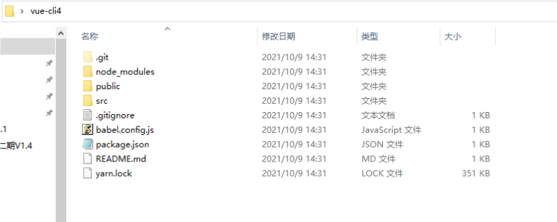
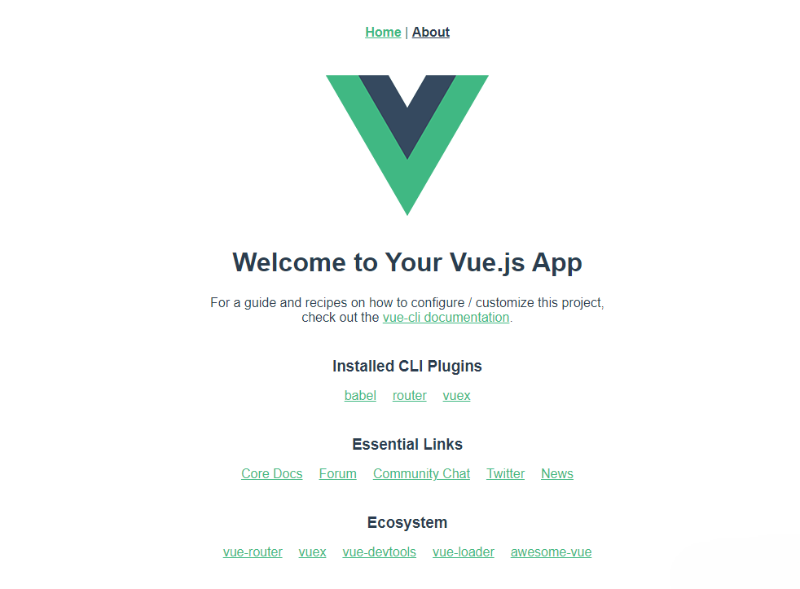

首先新建一个<font color=red> vue </font>测试项目，还记得以前自己是用<font color=red bgcolor=yellow> vue-cli 2.0的版本 </font>去构建的，毕竟里面有默认配置好的webpack配置，但现在很多小伙伴都已经用最新的<font color=red> @vue/cli 4+ </font>版本去开发了，因为<font color=red> @vue/cli  3 以上 </font>的版本，比<font color=red> 2.0 </font>的配置文件简洁了很多，**当然你还得跟上时代的脚步，不然你就被淘汰了**。

但自己搭建过的小伙伴都应该知道，<font color=red> @vue/cli 3 </font>和<font color=red> @vue/cli 4 </font>默认没有vue.config.js文件，所以需要自己来创建配置。在项目的根目录新建一个 vue.config.js 文件来覆盖项目的配置，因为项目的配置比较多，这里就不分别介绍了，可以 [访问官方文档](https://cli.vuejs.org/zh/config/#vue-config-js).

这里给出一个基本的：
```javascript
module.exports = {
  publicPath: "./",      // 公共路径(必须有的)
  outputDir: "dist",     // 输出文件目录
  assetsDir: "./static", // 静态资源存放的文件夹(相对于ouputDir) 一般都是static目录，不然默认的会是assets
  lintOnSave:false,      // eslint-loader 是否在保存的时候检查(果断不用，这玩意儿我都没装)
  runtimeCompiler: false,// 我用的only，打包后小些
  productionSourceMap: true, // 在生产环境会生产.map文件 设置false可以减小dist文件大小，加速构建
  devServer: {
    open: true,  // npm run serve后自动打开页面
    host: 'localhost',
    port: 8085, // 开发服务器运行端口号
    // hotOnly: true, // 热更新,
    // proxy: {
    //   '/api': {
    //     target: '127.0.0.1',
    //     changeOrigin: true,
    //     pathRewrite: {
    //       '^/api': ''
    //     },
    //   },
    // },
  },
  chainWebpack: () => {},
  configureWebpack: () => {},
}
```
## 一、安装

如果在电脑上已经安装了<font color=red> vue-cli 2.0 </font>或者<font color=red> @vue/cli 3 </font>的话需要先卸载再重新安装

| 简要说明 | <font color=red> vue-cli 2.0 </font> | <font color=red> @vue/cli 3 </font> |
| :--------: |:--------:| :------:|
| 安装 | npm install -g vue-cli | npm install -g @vue/cli |
| 卸载 | npm uninstall -g vue-cli |  npm uninstall -g @vue/cli |

<font color=red> 安装指定版本  </font>🎈
npm install -g @vue/cli@4.5.13

<font color=red> 查询可用包的版本号 </font> 
npm view @vue/cli versions --json

<font color=red> 版本查询 </font>（检测是否安装成功）<br>  vue -V <br>   
通过上面的步骤就可完成<font color=red> @vue/cli 4.5.13 </font>的安装。

## 二、创建项目

```javascript
vue create 项目名称   (*必须是英文，不允许大写，必须是小写英文) 
```
利用方向键 上、下来选择配置信息，点击回车进入下一步


（可以用上下键选择的忽略这步骤）如果在git Bash中不能用上下箭头选择，找到git 安装目录中bash.bashrc文件

然后在文件最底部加上  <font color=red> alias vue=‘winpty vue.cmd’ </font>

关闭再重新打开 git Bash 就可以上下选择啦 😎 🤣 😁
```javascript
Vue CLI v4.5.13
? Please pick a preset: Manually select features
? Check the features needed for your project:
 (*) Choose Vue version                         //  选择Vue版本
 (*) Babel                                      //  代码编译
 ( ) TypeScript                                 //  ts
 ( ) Progressive Web App (PWA) Support          //  支持渐进式网页应用程序
 (*) Router                                     //  vue路由
 (*) Vuex                                       //  状态管理模式
>(*) CSS Pre-processors                         //  css预处理
 ( ) Linter / Formatter                         //  代码风格、格式校验
 ( ) Unit Testing                               //  单元测试
 ( ) E2E Testing                                //  端对端测试
```
按<font color=red> 空格键 </font>进行配置，然后 回车 进入下一步
```javascript
Vue CLI v4.5.13
? Please pick a preset: Manually select features
? Check the features needed for your project: Choose Vue version, Babel, Router, Vuex, CSS Pre-processors
? Choose a version of Vue.js that you want to start the project with (Use arrow keys)
> 2.x
  3.x
```
这里我选择的是<font color=red> vue2.x </font>
```javascript
Vue CLI v4.5.13
? Please pick a preset: Manually select features
? Check the features needed for your project: Choose Vue version, Babel, Router, Vuex, CSS Pre-processors
? Choose a version of Vue.js that you want to start the project with 2.x
? Use history mode for router? (Requires proper server setup for index fallback in production) (Y/n) y
```
选择是否使用路由 history router，我这里选择 <font color=red>是</font>
```javascript
Vue CLI v4.5.13
? Please pick a preset: Manually select features
? Check the features needed for your project: Choose Vue version, Babel, Router, Vuex, CSS Pre-processors
? Choose a version of Vue.js that you want to start the project with 2.x
? Use history mode for router? (Requires proper server setup for index fallback
in production) Yes
? Pick a CSS pre-processor (PostCSS, Autoprefixer and CSS Modules are supported by default):
  Sass/SCSS (with dart-sass)
  Sass/SCSS (with node-sass)
> Less
  Stylus
```
我选择<font color=red> Less </font>编译方式
```javascript
Vue CLI v4.5.13
? Please pick a preset: Manually select features
? Check the features needed for your project: Choose Vue version, Babel, Router, Vuex, CSS Pre-processors
? Choose a version of Vue.js that you want to start the project with 2.x
? Use history mode for router? (Requires proper server setup for index fallback
in production) Yes
? Pick a CSS pre-processor (PostCSS, Autoprefixer and CSS Modules are supported by default): Less
? Where do you prefer placing config for Babel, ESLint, etc.?
  In dedicated config files
> In package.json
```
选择 <font color=red> package.json </font>
```javascript
Vue CLI v4.5.13
? Please pick a preset: Manually select features
? Check the features needed for your project: Choose Vue version, Babel, Router, Vuex, CSS Pre-processors
? Choose a version of Vue.js that you want to start the project with 2.x
? Use history mode for router? (Requires proper server setup for index fallback
in production) Yes
? Pick a CSS pre-processor (PostCSS, Autoprefixer and CSS Modules are supported by default): Less
? Where do you prefer placing config for Babel, ESLint, etc.? In package.json
? Save this as a preset for future projects? (y/N) n
```
是否保存当前选择的配置项，如果当前配置是经常用到的配置，建议选择y存储一下当前配置项。如果只是临时使用的话就不需要存储了，根据自己情况而定啦。

但是我是之前已经配置保存了，所以这里 <font color=red> 我选 n </font>

## 三、运行项目
项目创建完毕，打开文件夹

```
npm run serve               // 运行项目
```


